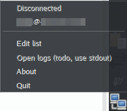

# Shadowban
One-executable Shadowsocks/Outline client. 
Embeds outline-go-tun2socks used by original Outline client.



## Bugs
- Can't run from sudo. Must be executed as a normal user and then elevated to root.
- Can't reconnect. This is a bug in go-2tunsocks that assumes that we disconnect killing the TUN process and never closes /dev/net/tun.
- Can't write logs. Root side of Shadowban just don't write in Stdout set in user side.

## Todo
- Refactor. I wrote this code mostly during nighttime.
- Use geoip.dat to paint flags for proxies in menu.
- Make interface actually be based on the state diagram (see [design.excalidraw.png]).
- Change tray icon. Use icon to show connection state maybe?

## Dependencies
- go 1.18 (for building, no release before I fix everything)
- pkexec
- openresolv (resolvconf)

## How to disconnect if Shadowban has messed up.
Sometimes it's just enough to reconnect to your WiFi or wired network using a connection manager.

- `ip route`
```
default via 10.0.88.2 dev wlan0 
10.0.88.0/24 dev shadowban-tun proto kernel scope link src 10.0.88.2 linkdown 
X.X.X.X via 192.168.1.1 dev wlan0 metric 5 
127.0.0.0/8 via 127.0.0.1 dev lo 
172.17.0.0/16 dev docker0 proto kernel scope link src 172.17.0.1 linkdown 
192.168.1.0/24 dev wlan0 proto kernel scope link src 192.168.1.2 
192.168.1.1 dev wlan0 scope link 
```
- Take an address after “via” in line where X.X.X.X is address of last connected proxy.
- `sudo ip route change default via 192.168.1.1`
